# Docker Two-Tier Flask Application

## Project Overview

This project demonstrates how to containerize and deploy a two-tier application using Docker.

The application consists of:

* Flask Web Application (Frontend/Backend)
* MySQL Database
* Docker Network for container communication
* Docker Volume for persistent storage
* Multi-Stage Docker Build
* Docker Compose for orchestration

The project was implemented and tested on an AWS EC2 Ubuntu server.

---

## Architecture

```text
+------------------+
|   Flask App      |
|   Port : 5000    |
+---------+--------+
          |
          |
          v
+------------------+
|      MySQL       |
|   Port : 3306    |
+------------------+
```

---

## Technologies Used

* Docker
* Docker Compose
* Python Flask
* MySQL
* Linux (Ubuntu EC2)
* AWS EC2


# Implementation Steps

## 1. Clone Repository and Review Project Structure

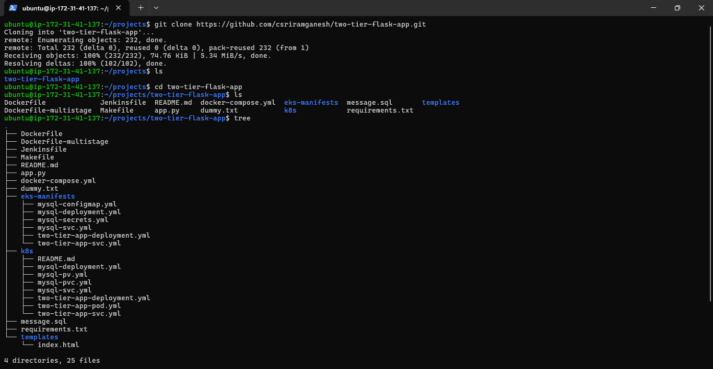

---

## 2. Create Dockerfile

Created a Dockerfile to containerize the Flask application.

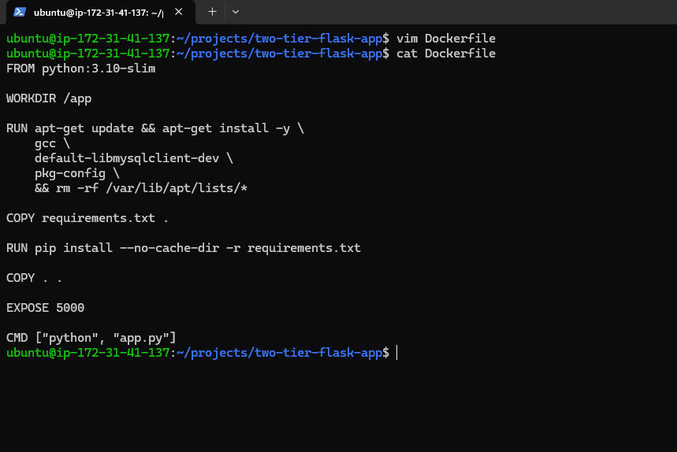

---

## 3. Build Docker Image

Built the Flask application image.

```bash
docker build -t flask-app:v1 .
```

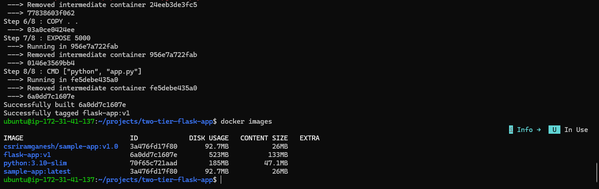

---

## 4. Create Custom Docker Network

Created a dedicated network for communication between Flask and MySQL containers.

```bash
docker network create twotier
```

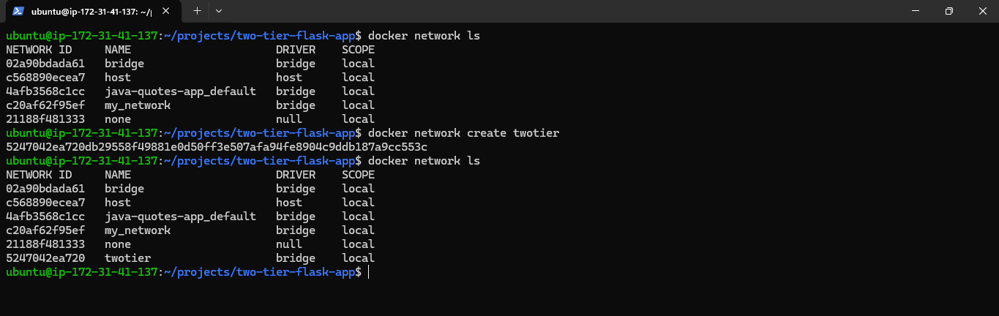

---

## 5. Create Docker Volume

Created a persistent volume for MySQL data storage.

```bash
docker volume create mysql-data
```

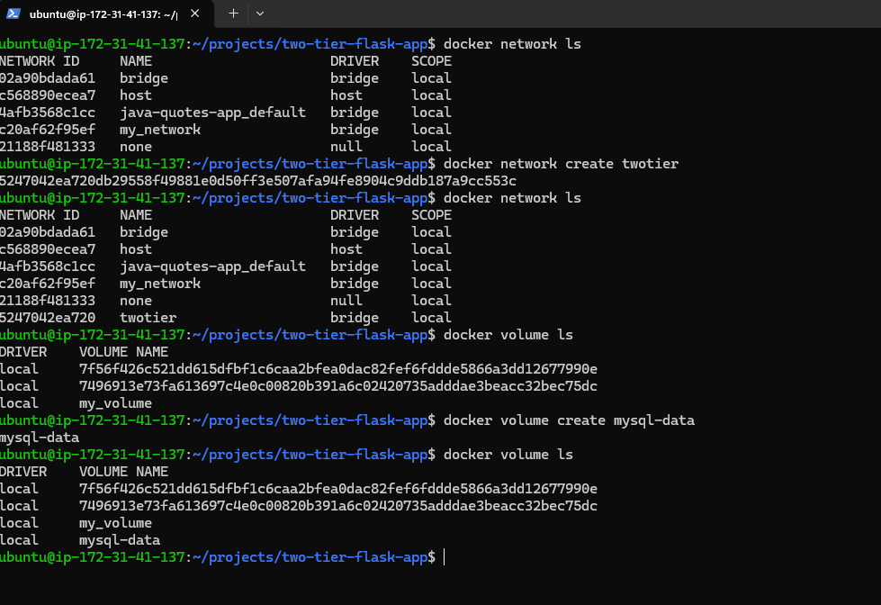

---

## 6. Run MySQL Container

Started the MySQL database container.

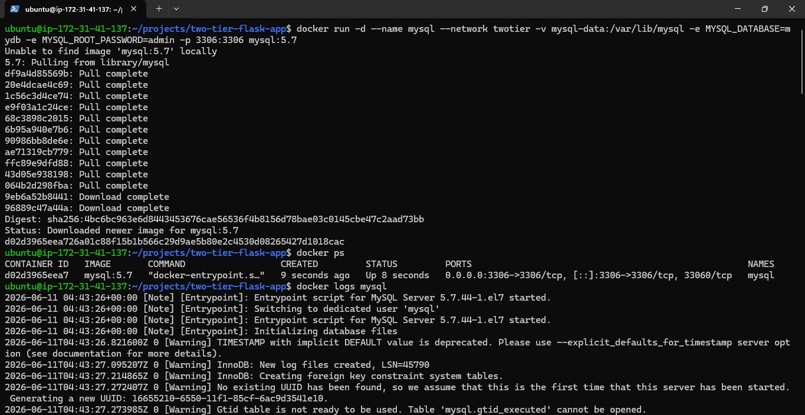

---

## 7. Run Flask Container

Started the Flask application container and connected it to the Docker network.

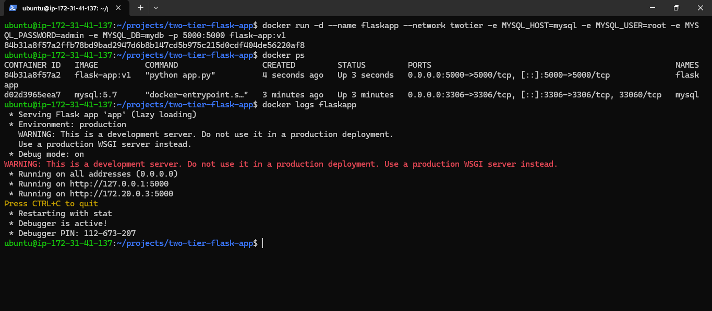

---

## 8. Access Application in Browser

Verified that the application is accessible through the browser.

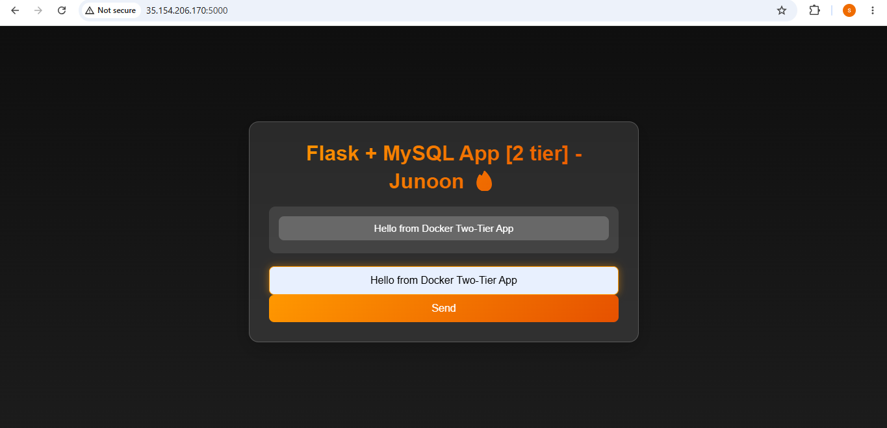

---

## 9. Verify Data Storage in MySQL

Inserted data from the application and verified it inside the MySQL database.

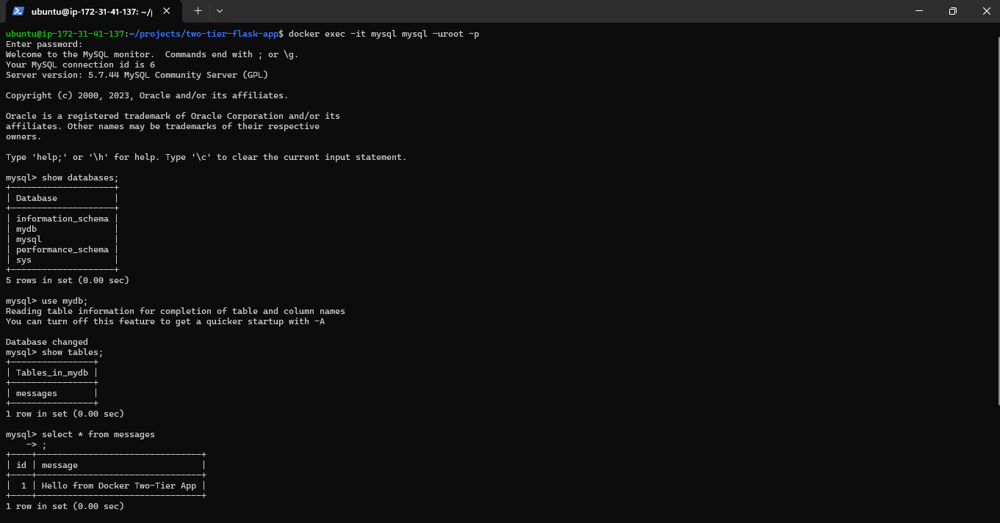

---

## 10. Verify Volume Persistence

Deleted containers and recreated them using the same Docker volume.

Verified that MySQL data persisted successfully.

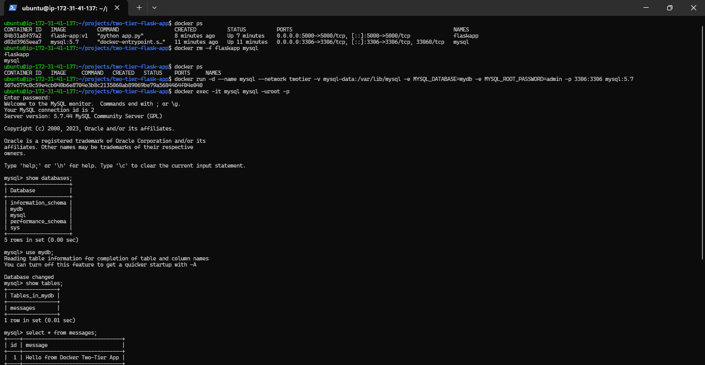

---

## 11. Inspect Docker Network

Inspected the Docker network and verified container connectivity.

```bash
docker network inspect twotier
```

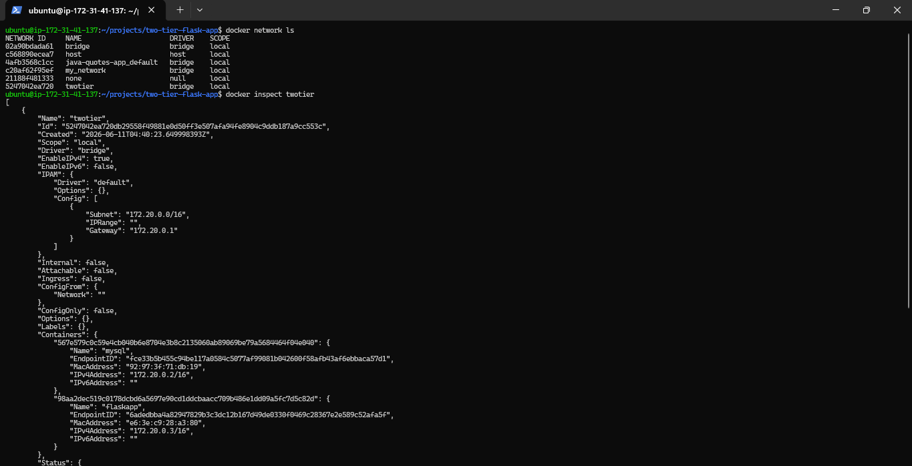

---

## 12. Create Multi-Stage Dockerfile

Created a multi-stage Docker build to optimize image size and improve security.

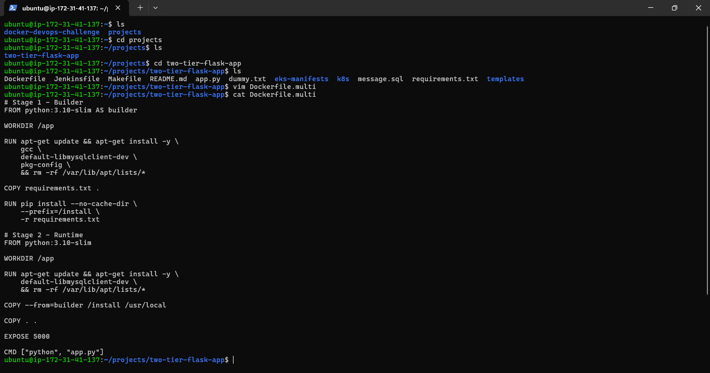

---

## 13. Build Multi-Stage Image and Compare Sizes

Built the optimized image and compared image sizes.

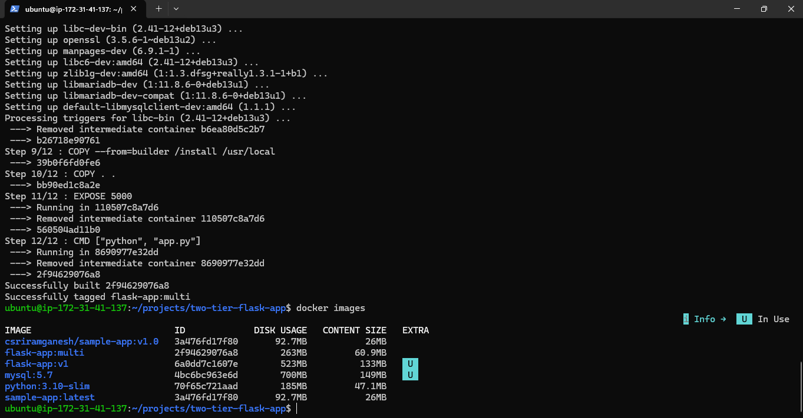

---

## 14. Run Multi-Stage Container

Verified that the optimized image runs successfully.

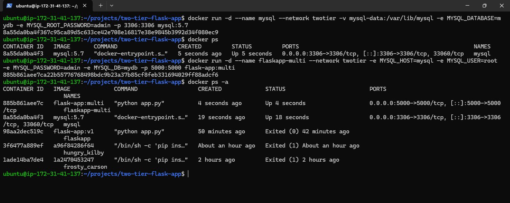

---

## 15. Create Docker Compose Configuration

Created a docker-compose.yml file to manage the complete application stack.

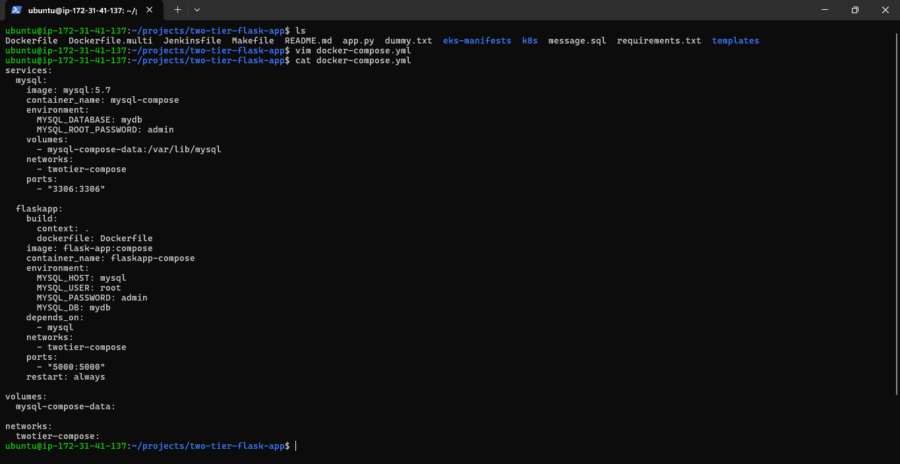

---

## 16. Deploy Application Using Docker Compose

Started the application stack using Docker Compose.

```bash
docker compose up -d --build
```

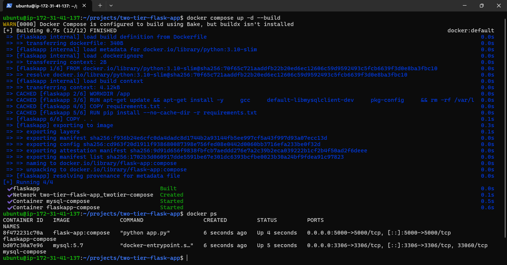

---

## 17. Troubleshooting and Fix

While deploying with Docker Compose, the Flask container initially failed because MySQL was not fully ready when Flask attempted to connect.

Resolved the issue by adding a restart policy and redeploying the stack.

This simulates a real-world troubleshooting scenario.

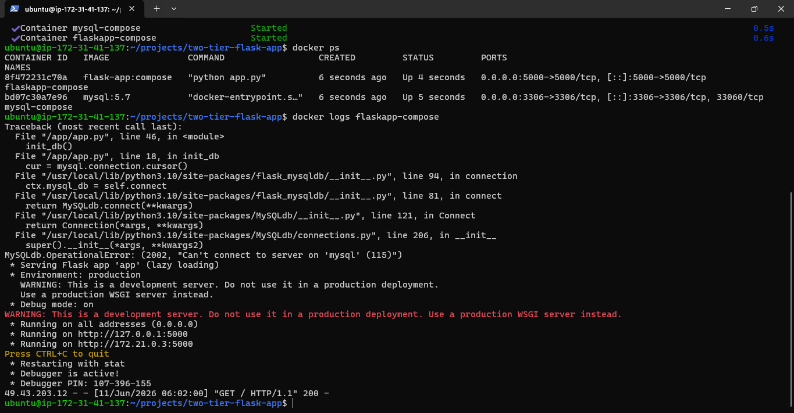

---

# Key Docker Concepts Demonstrated

* Docker Images
* Docker Containers
* Dockerfile
* Multi-Stage Builds
* Docker Networks
* Container Communication
* Docker Volumes
* Data Persistence
* Environment Variables
* MySQL Containerization
* Flask Containerization
* Docker Compose
* Troubleshooting Container Startup Issues

---

# Commands Used

## Build Image

```bash
docker build -t flask-app:v1 .
```

## Create Network

```bash
docker network create twotier
```

## Create Volume

```bash
docker volume create mysql-data
```

## Run MySQL Container

```bash
docker run -d --name mysql --network twotier -v mysql-data:/var/lib/mysql -e MYSQL_DATABASE=mydb -e MYSQL_ROOT_PASSWORD=admin -p 3306:3306 mysql:5.7
```

## Run Flask Container

```bash
docker run -d --name flaskapp --network twotier -e MYSQL_HOST=mysql -e MYSQL_USER=root -e MYSQL_PASSWORD=admin -e MYSQL_DB=mydb -p 5000:5000 flask-app:v1
```

## Deploy with Docker Compose

```bash
docker compose up -d --build
```

---

# Learning Outcomes

Through this project, I gained hands-on experience with:

* Building Docker images
* Running multi-container applications
* Managing Docker networks and volumes
* Implementing multi-stage builds
* Using Docker Compose
* Troubleshooting container startup dependencies
* Deploying applications on AWS EC2

---

## Author

**Sriram Ganesh**


